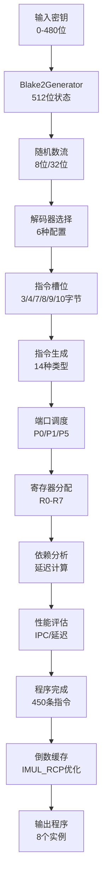

# 01_总体架构与数据流

## 📋 概述

SuperscalarProgram 生成器是 RandomX/Panthera 算法的核心组件之一，负责生成8个高度优化的指令序列，用于 Dataset 构建过程中的 Cache 访问计算。本文档详细分析其架构设计、数据流向和各模块间的位宽接口。

## 🏗️ 总体架构

### 系统层次结构

```
┌─────────────────────────────────────────────────────────────┐
│                  SuperscalarProgram 生成系统                  │
├─────────────────────────────────────────────────────────────┤
│  输入层: Blake2Generator (伪随机数源)                         │
├─────────────────────────────────────────────────────────────┤
│  控制层: CPU模拟器 + 解码器选择                               │
├─────────────────────────────────────────────────────────────┤
│  计算层: 指令生成 + 端口调度 + 寄存器分配                     │
├─────────────────────────────────────────────────────────────┤
│  优化层: 依赖分析 + 性能评估                                 │
├─────────────────────────────────────────────────────────────┤
│  输出层: 8个SuperscalarProgram + 倒数缓存                    │
└─────────────────────────────────────────────────────────────┘
```

### 核心组件详解

| 组件名称 | 功能职责 | 输入接口 | 输出接口 | 位宽特征 |
|----------|----------|----------|----------|----------|
| **Blake2Generator** | 提供高质量伪随机数 | 密钥(0-480位) + nonce | 64字节随机数据 | 512位内部状态 |
| **DecoderBuffer** | CPU解码器配置管理 | 指令类型 + 周期信息 | 解码槽位配置 | 6种16字节配置 |
| **SuperscalarInstruction** | 单条指令封装 | 槽位大小 + 随机数 | 完整指令描述 | 64位指令格式 |
| **RegisterInfo** | 寄存器状态跟踪 | 延迟信息 + 依赖 | 寄存器可用性 | 32位延迟计数 |
| **ExecutionPort** | 执行端口模拟 | 微操作调度 | 端口占用状态 | 3×170位端口图 |
| **SuperscalarProgram** | 最终程序容器 | 指令序列 | 完整程序 + 元数据 | 可变长度指令数组 |

## 🔄 数据流分析

### 主数据流图



### 位宽流转详细表

| 阶段 | 数据类型 | 输入位宽 | 处理位宽 | 输出位宽 | 数据来源 | 数据去向 |
|------|----------|----------|----------|----------|----------|----------|
| **初始化** | 密钥输入 | 0-480位 | 8位字节处理 | 密钥引用 | 外部调用 | Blake2Generator |
| **随机数生成** | Blake2状态 | 512位状态 | 64字节缓冲 | 8/32位随机数 | 密钥哈希 | 指令生成器 |
| **解码器选择** | 配置索引 | 8位随机数 | 解码器状态 | 槽位配置 | Blake2Generator | 指令槽分配 |
| **指令生成** | 槽位大小 | 4位槽位ID | 指令模板 | 64位指令 | 解码器 | 端口调度器 |
| **端口调度** | 微操作 | 指令+端口状态 | 调度算法 | 执行周期 | 指令生成器 | 寄存器分配 |
| **寄存器分配** | 约束条件 | 寄存器+依赖 | 选择算法 | 8位寄存器ID | 端口调度器 | 依赖分析 |
| **依赖分析** | 指令依赖 | 完整指令 | 依赖图 | 延迟信息 | 寄存器分配 | 性能评估 |
| **程序输出** | 完整程序 | 指令数组 | 程序封装 | 程序+元数据 | 依赖分析 | 倒数缓存 |

## 📊 关键位宽接口规格

### 1. Blake2Generator 接口

```cpp
class Blake2Generator {
    // 输入接口
    Blake2Generator(const void* key, size_t keySize, int nonce = 0);
    
    // 输出接口  
    uint8_t getByte();      // 8位随机字节
    uint32_t getUInt32();   // 32位随机整数
    
    // 内部状态
    uint8_t data[64];       // 512位数据缓冲
    size_t dataIndex;       // 64位索引
};
```

**位宽分析**:
- 输入: 密钥(0-480位) + 长度(32位) + nonce(32位)
- 内部: 512位Blake2b状态 + 64字节输出缓冲
- 输出: 8位字节流或32位整数流

### 2. SuperscalarInstruction 接口

```cpp
struct SuperscalarInstruction {
    SuperscalarInstructionType type_;    // 8位指令类型
    uint8_t dst_;                       // 4位目标寄存器
    int8_t src_;                        // 4位源寄存器
    uint8_t mod_;                       // 8位修饰符
    uint32_t imm32_;                    // 32位立即数
    // 总计: 64位指令格式
};
```

**位宽分析**:
- 指令类型: 8位 (支持14种指令类型)
- 寄存器字段: 4位×2 = 8位 (R0-R7)
- 修饰符: 8位 (移位量、掩码等)
- 立即数: 32位 (常量、地址偏移)
- 对齐填充: 12位 (总计64位对齐)

### 3. ExecutionPort 状态

```cpp
enum ExecutionPort {
    P0 = 0,    // 通用ALU端口
    P1 = 1,    // 乘法专用端口  
    P5 = 2     // 通用ALU端口
};

// 端口占用矩阵 [CYCLE_MAP_SIZE][3]
ExecutionPort::type portBusy[170][3];  // 170周期×3端口 = 510位状态
```

**位宽分析**:
- 单端口状态: 2位 (空闲/占用/类型)
- 3端口状态: 6位/周期
- 170周期映射: 1020位总状态
- 查询/更新: 单周期6位操作

### 4. RegisterInfo 状态

```cpp
class RegisterInfo {
    int latency;                        // 32位延迟计数
    SuperscalarInstructionType lastOpGroup;  // 8位最后操作组
    int lastOpPar;                      // 32位操作参数
    int value;                          // 32位寄存器值
    // 每个寄存器: 104位状态信息
};

RegisterInfo registers[8];  // 8个寄存器 × 104位 = 832位总状态
```

**位宽分析**:
- 单寄存器状态: 104位
- 8寄存器总状态: 832位
- 延迟计算: 32位整数运算
- 依赖检查: 指令类型比较(8位)

## 🎯 生成流程核心算法

### 主生成循环

```cpp
void generateSuperscalar(SuperscalarProgram& prog, Blake2Generator& gen) {
    // 1. 初始化阶段 (固定位宽设置)
    ExecutionPort::type portBusy[170][3];  // 510×2位端口状态
    RegisterInfo registers[8];              // 8×104位寄存器状态
    
    // 2. 解码循环 (最多170周期)
    for (decodeCycle = 0; decodeCycle < 170 && !portsSaturated; ++decodeCycle) {
        
        // 3. 解码器配置选择 (6种配置×不同槽位)
        decodeBuffer = selectDecodeBuffer(gen.getByte());  // 8位→配置选择
        
        // 4. 指令槽位填充
        while (bufferIndex < decodeBuffer->getSize()) {
            // 5. 指令生成 (基于槽位大小)
            currentInstruction.createForSlot(gen, slotSize);  // 随机数→64位指令
            
            // 6. 端口调度 (微操作→执行端口)
            scheduleCycle = scheduleMop(mop, portBusy, cycle);  // 调度算法
            
            // 7. 寄存器分配 (约束条件→寄存器选择)
            selectRegister(availableRegisters, gen, reg);  // 可用性→寄存器ID
            
            // 8. 依赖更新 (延迟信息更新)
            updateRegisterLatency(registers, dst, depCycle);  // 延迟→寄存器状态
        }
    }
    
    // 9. 性能分析 (程序→性能指标)
    calculatePerformanceMetrics(prog);  // 指令数组→IPC/延迟
}
```

### 终止条件判断

程序生成在以下任一条件满足时终止：

1. **时间限制**: `decodeCycle >= RANDOMX_SUPERSCALAR_LATENCY (170)`
2. **端口饱和**: `portsSaturated == true`
3. **程序长度**: `programSize >= SuperscalarMaxSize`

### 输出数据结构

```cpp
class SuperscalarProgram {
    Instruction programBuffer[SuperscalarMaxSize];  // 可变长度指令数组
    uint32_t size;                                  // 32位程序大小
    int addrReg;                                    // 8位地址寄存器
    double ipc;                                     // 64位IPC指标
    int cpuLatency;                                 // 32位CPU延迟
    int asicLatency;                                // 32位ASIC延迟
    int mulCount;                                   // 32位乘法指令计数
    int cpuLatencies[8];                            // 8×32位寄存器延迟
    int asicLatencies[8];                           // 8×32位ASIC延迟
};
```

**输出位宽统计**:
- 指令数组: 450条×64位 = 28,800位
- 元数据: 约400位
- 总计: ~29,200位/程序
- 8个程序: ~233,600位 (约29KB)

## 🔍 关键性能指标

### 生成时间复杂度

| 操作类型 | 时间复杂度 | 位宽操作 | 说明 |
|----------|------------|----------|------|
| **Blake2 生成** | O(1) | 512位状态更新 | 每次8/32位输出 |
| **指令生成** | O(n) | n×64位指令 | n≈450条指令 |
| **端口调度** | O(n×m) | n×指令, m×端口状态 | 170周期×3端口 |
| **寄存器分配** | O(n×r) | n×指令, r×寄存器状态 | 8个寄存器跟踪 |
| **依赖分析** | O(n²) | 指令间依赖检查 | 最坏情况完全依赖 |

### 内存使用分析

| 组件 | 内存占用 | 位宽说明 |
|------|----------|----------|
| **端口状态** | 170×3×2位 = 1,020位 | 约128字节 |
| **寄存器状态** | 8×104位 = 832位 | 约104字节 |
| **指令缓冲** | 450×64位 = 28,800位 | 约3.6KB |
| **解码器状态** | 6×配置 | 约192字节 |
| **总计** | | 约4KB/程序 |

## 📈 性能优化要点

### 1. 位操作优化
- 使用位运算进行端口状态查询
- 寄存器掩码快速可用性检查
- 指令字段位移操作优化

### 2. 缓存友好性
- 紧凑的数据结构布局
- 顺序访问模式优化
- 局部性原理利用

### 3. 并行潜力
- 8个程序可独立并行生成
- 端口调度可向量化计算
- 寄存器分配可预测性分析

---

**下一节预告**: [02_Blake2Generator伪随机数生成器.md](./02_Blake2Generator伪随机数生成器.md) - 深入分析伪随机数生成的具体实现和位宽处理细节。 