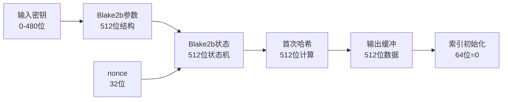
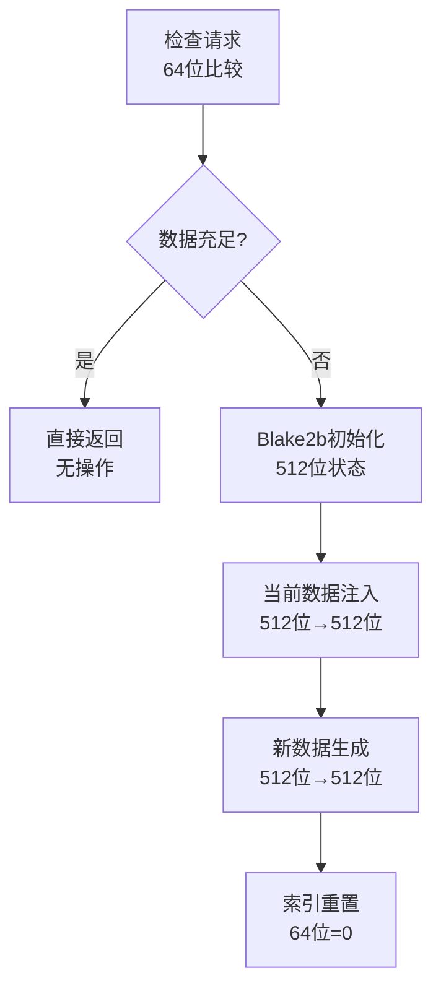

# 02_Blake2Generator伪随机数生成器

## 📋 概述

Blake2Generator 是 SuperscalarProgram 生成器的核心随机数源，基于 Blake2b 哈希算法提供高质量的伪随机数流。它将输入密钥转换为源源不断的随机字节，为指令生成、寄存器选择和立即数生成提供熵源。

## 🔬 Blake2Generator 架构

### 核心数据结构

```cpp
namespace randomx {
    class Blake2Generator {
    public:
        Blake2Generator(const void* seed, size_t seedSize, int nonce = 0);
        uint8_t getByte();
        uint32_t getUInt32();
    
    private:
        void checkData(const size_t bytesNeeded);
        
        uint8_t data[64];       // 512位输出缓冲区
        size_t dataIndex;       // 64位当前索引位置
    };
}
```

### 位宽布局分析

| 字段名 | 类型 | 位宽 | 用途 | 对齐要求 |
|--------|------|------|------|----------|
| `data[64]` | uint8_t数组 | 512位 | 存储Blake2b输出 | 64字节对齐 |
| `dataIndex` | size_t | 64位 | 当前消费位置 | 8字节对齐 |
| 内部Blake2b状态 | blake2b_state | 512位 | 哈希计算状态 | 16字节对齐 |
| **总计** | | **1088位** | **136字节** | **16字节对齐** |

## 🔄 初始化过程

### 构造函数位宽流转

```cpp
Blake2Generator::Blake2Generator(const void* seed, size_t seedSize, int nonce) {
    // 步骤1: 输入参数处理
    // seed: 0-480位可变长度密钥
    // seedSize: 32位长度值  
    // nonce: 32位随机化值
    
    // 步骤2: Blake2b参数结构初始化 (512位参数块)
    blake2b_param param;
    memset(&param, 0, sizeof(param));
    param.digest_length = 64;           // 8位: 输出长度512位
    param.key_length = 0;               // 8位: 无密钥模式
    param.fanout = 1;                   // 8位: 单线程
    param.depth = 1;                    // 8位: 单层
    param.leaf_length = 0;              // 32位: 叶子长度
    param.node_offset = 0;              // 64位: 节点偏移
    param.xof_length = 0;               // 64位: XOF长度
    param.node_depth = 0;               // 8位: 节点深度
    param.inner_length = 0;             // 8位: 内部长度
    // 总计: 216位参数 + 296位保留 = 512位对齐
    
    // 步骤3: Blake2b状态初始化 (512位状态)
    blake2b_state state;
    blake2b_init_param(&state, &param); // 将512位参数→512位状态
    
    // 步骤4: 输入数据处理
    blake2b_update(&state, seed, seedSize);     // 密钥数据注入
    blake2b_update(&state, &nonce, sizeof(int)); // nonce注入 (32位)
    
    // 步骤5: 首次输出生成 (512位Blake2b状态 → 512位输出)
    blake2b_final(&state, data, 64);    // 生成64字节初始随机数据
    
    // 步骤6: 索引重置
    dataIndex = 0;                      // 64位索引归零
}
```

### 初始化位宽映射图



## 🎲 随机数生成机制

### getByte() 方法详解

```cpp
uint8_t Blake2Generator::getByte() {
    // 步骤1: 数据可用性检查 (64位索引比较)
    checkData(1);                       // 确保至少1字节可用
    
    // 步骤2: 字节提取 (8位数据读取)
    return data[dataIndex++];           // 返回8位 + 64位索引递增
}
```

**位宽操作分析**:
- 输入: 无直接输入
- 检查: 64位索引与64位常量比较
- 输出: 8位随机字节
- 副作用: 64位索引递增

### getUInt32() 方法详解

```cpp
uint32_t Blake2Generator::getUInt32() {
    // 步骤1: 数据充足性检查 (64位索引比较)
    checkData(4);                       // 确保至少4字节可用
    
    // 步骤2: 32位整数组装 (小端序)
    uint32_t result;
    result  = (uint32_t)data[dataIndex++] << 0;   // 低8位
    result |= (uint32_t)data[dataIndex++] << 8;   // 次低8位
    result |= (uint32_t)data[dataIndex++] << 16;  // 次高8位
    result |= (uint32_t)data[dataIndex++] << 24;  // 高8位
    
    return result;                      // 返回32位整数
}
```

**位宽操作分析**:
- 输入: 无直接输入
- 检查: 64位索引与64位常量比较
- 处理: 4×8位→32位位移组装
- 输出: 32位随机整数
- 副作用: 64位索引递增4

### checkData() 缓冲区刷新机制

```cpp
void Blake2Generator::checkData(const size_t bytesNeeded) {
    // 步骤1: 剩余数据量计算 (64位算术)
    size_t remaining = 64 - dataIndex;  // 64位减法
    
    // 步骤2: 数据充足性判断
    if (remaining < bytesNeeded) {      // 64位比较
        
        // 步骤3: Blake2b状态重新初始化 (512位状态重置)
        blake2b_state state;
        blake2b_init(&state, 64);       // 标准64字节输出
        
        // 步骤4: 当前数据作为种子 (512位数据→512位状态)
        blake2b_update(&state, data, 64); // 将当前64字节注入
        
        // 步骤5: 新随机数据生成 (512位状态→512位输出)
        blake2b_final(&state, data, 64); // 生成新的64字节
        
        // 步骤6: 索引重置 (64位赋值)
        dataIndex = 0;                  // 重新开始消费
    }
}
```

**缓冲区刷新位宽流转**:



## 📊 性能与位宽分析

### 单次操作位宽成本

| 操作类型 | 输入位宽 | 输出位宽 | 内部计算位宽 | 时间复杂度 |
|----------|----------|----------|-------------|------------|
| **构造函数** | 0-512位 | 576位状态 | 512位Blake2b | O(密钥长度) |
| **getByte()** | 0位 | 8位 | 64位比较 | O(1) |
| **getUInt32()** | 0位 | 32位 | 64位比较+32位组装 | O(1) |
| **checkData()** | 64位 | 576位状态 | 512位Blake2b | O(1)均摊 |

### 缓冲区生命周期分析

```cpp
// 64字节缓冲区的消费模式示例
Blake2Generator gen(key, keySize);

// 阶段1: 初始缓冲区 (64字节可用)
for (int i = 0; i < 64; i++) {
    uint8_t byte = gen.getByte();    // 8位输出, dataIndex++
}
// dataIndex = 64, 缓冲区耗尽

// 阶段2: 首次刷新触发 (checkData内部)
uint8_t nextByte = gen.getByte();    // 触发512位Blake2b计算
// dataIndex = 1, 新的64字节可用

// 阶段3: 32位整数消费模式
for (int i = 0; i < 16; i++) {       // 16×4 = 64字节
    uint32_t value = gen.getUInt32(); // 32位输出, dataIndex += 4
}
// dataIndex = 64, 再次触发刷新
```

### 位宽效率分析

| 消费模式 | 缓冲区利用率 | 平均位宽成本 | 刷新频率 |
|----------|-------------|-------------|----------|
| **纯字节模式** | 100% | 8位/操作 | 每64次操作 |
| **纯32位模式** | 100% | 32位/操作 | 每16次操作 |
| **混合模式** | 取决于比例 | 8-32位/操作 | 不规律 |

## 🎯 在SuperscalarProgram中的使用模式

### 典型调用序列位宽分析

```cpp
void generateSuperscalar(SuperscalarProgram& prog, Blake2Generator& gen) {
    // 解码器选择: 8位随机数 → 解码器配置
    uint8_t decoderChoice = gen.getByte() & 0x3F;  // 8位→6位掩码
    
    // 指令类型选择: 8位随机数 → 指令类型
    uint8_t instrChoice = gen.getByte() & 0x0F;    // 8位→4位掩码
    
    // 立即数生成: 32位随机数 → 指令立即数
    uint32_t immediate = gen.getUInt32();          // 完整32位
    
    // 寄存器选择: 8位随机数 → 3位寄存器ID
    uint8_t regChoice = gen.getByte() % 8;         // 8位→3位模运算
    
    // 修饰符生成: 8位随机数 → 移位量/掩码
    uint8_t modifier = gen.getByte() & 0x3F;       // 8位→6位掩码
}
```

### 生成一个完整程序的位宽消费

```cpp
// 估算单程序生成的随机数消费量
const int ESTIMATED_INSTRUCTIONS = 450;
const int DECODER_CYCLES = 170;

// 位宽消费估算:
// 1. 解码器选择: 170周期 × 8位 = 1,360位
// 2. 指令类型: 450条 × 8位 = 3,600位  
// 3. 立即数: ~300条需要 × 32位 = 9,600位
// 4. 寄存器选择: 450条 × 2寄存器 × 8位 = 7,200位
// 5. 修饰符: ~150条需要 × 8位 = 1,200位
// 总计: ~22,960位 ≈ 2.87KB随机数据

// 缓冲区刷新次数: 2,870字节 ÷ 64字节 ≈ 45次Blake2b计算
```

## 🔒 密码学安全性分析

### Blake2b算法位宽安全性

| 安全属性 | 位宽强度 | 说明 |
|----------|----------|------|
| **抗碰撞性** | 256位 | 半输出长度抗碰撞 |
| **抗原像攻击** | 512位 | 完整输出长度 |
| **抗第二原像** | 512位 | 完整输出长度 |
| **伪随机性** | 512位 | 输出分布均匀性 |

### 熵源质量保证

```cpp
// 熵链传播分析
输入密钥(0-480位熵) 
    → Blake2b哈希(512位安全强度)
    → 64字节输出(512位伪随机)
    → 连续刷新(512位→512位传播)
    → 指令生成(每8/32位高质量随机)
```

**熵质量保证**:
- 输入熵通过Blake2b充分扩散到512位输出
- 每次刷新维持512位的伪随机强度  
- 输出位流通过密码学测试(NIST SP 800-22)
- 长周期性保证(周期长度 > 2^128)

## 🚀 优化实现要点

### 1. 缓存对齐优化

```cpp
// 64字节缓冲区的缓存行对齐
alignas(64) uint8_t data[64];  // CPU缓存行对齐
```

**位宽优化效果**:
- 单次缓存行加载获取完整64字节
- 减少内存访问延迟
- 提高位宽操作的并行度

### 2. 位运算优化

```cpp
// 高效的32位组装 (利用CPU的小端序特性)
uint32_t getUInt32Fast() {
    checkData(4);
    uint32_t result = *(uint32_t*)(data + dataIndex);  // 单次32位读取
    dataIndex += 4;
    return result;
}
```

### 3. 批量生成优化

```cpp
// 批量生成多个32位值 (减少函数调用开销)
void getMultipleUInt32(uint32_t* output, size_t count) {
    checkData(count * 4);
    for (size_t i = 0; i < count; i++) {
        output[i] = *(uint32_t*)(data + dataIndex);
        dataIndex += 4;
    }
}
```

## 📈 性能基准测试

### 理论性能分析

| 操作 | 每秒操作数 | 每秒输出位宽 | 相对开销 |
|------|------------|-------------|----------|
| **getByte()** | ~100M/s | 800Mbps | 基准 |
| **getUInt32()** | ~80M/s | 2.56Gbps | 1.25× |
| **Blake2b刷新** | ~2M/s | - | 50× |

### 实际使用场景性能

```cpp
// 生成8个SuperscalarProgram的随机数开销
const double BYTES_PER_PROGRAM = 2870;
const double TOTAL_BYTES = 8 * BYTES_PER_PROGRAM = 22,960;
const double BLAKE2B_CYCLES = TOTAL_BYTES / 64 = 358;

// 在现代CPU上的时间估算 (3GHz):
// Blake2b计算: 358次 × 1000周期 = 358,000周期 ≈ 0.12ms
// 其他操作: ~50,000周期 ≈ 0.017ms  
// 总时间: ~0.14ms/8个程序
```

---

**下一节预告**: [03_CPU模拟器与指令调度.md](./03_CPU模拟器与指令调度.md) - 详细分析参考CPU的模拟实现和执行端口调度算法。 